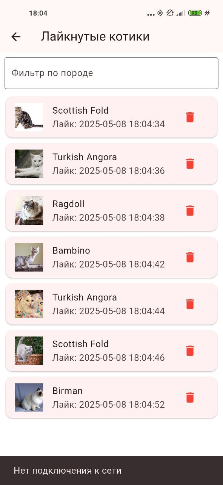
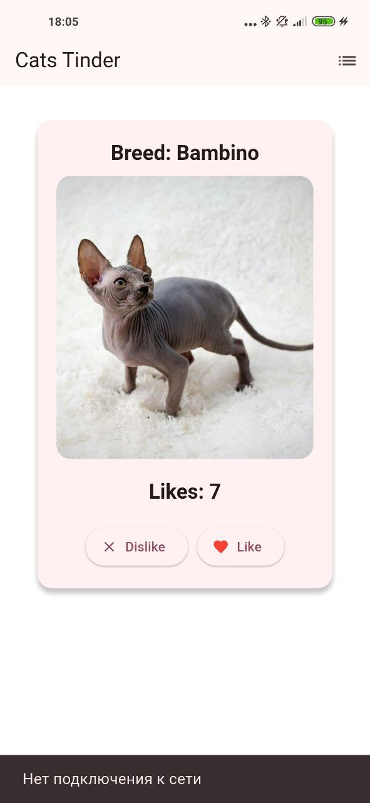
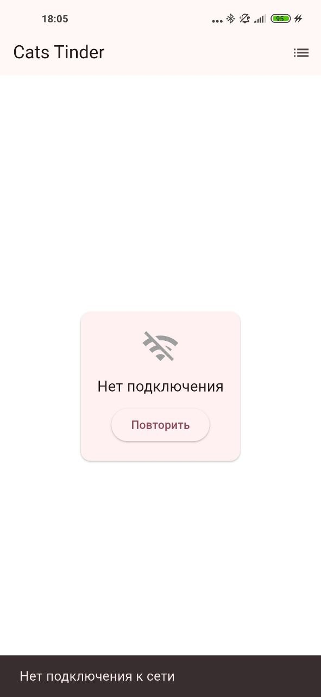

# CatApp

1. Приложение представляет собой тиндер, только с кошками. Можно свайпать вправо или лайкать понравившихся кошек, можно свайпать влево или дизлайкать котиков, которые не понравились. Для детального описания котика можно нажать на его изображение. Чтобы выйти с появившегося экрана, можно нажать на крестик или повторно нажать на котика.

2. Был реализован экран со списком всех лайкнутых котиков (справа сверху). Оттуда можно удалять котиков, счетчик при этом уменьшится. Список можно пролистывать, реализован поиск по породе. При возникновении проблем с сетью карточка заменяется на сообщение об ошибке, которое пропадает как только сеть восстанавливается.

3. Было реализовано оффлайн взаимодействие с приложением. При заходе в приложение подгружаются ранее лайкнутые котики и количество лайков. Если пропадает сеть, то вылезает SnackBar, уведомляющий о том, что сети нет. Если пользователь заходит в приложение изначально без сети, то высвечивается окно, что нет интернета. Как только сеть появляется, SnackBar пропадает

Актуальную версию apk можно скачать в репозитории из корня: CatApp.apk

