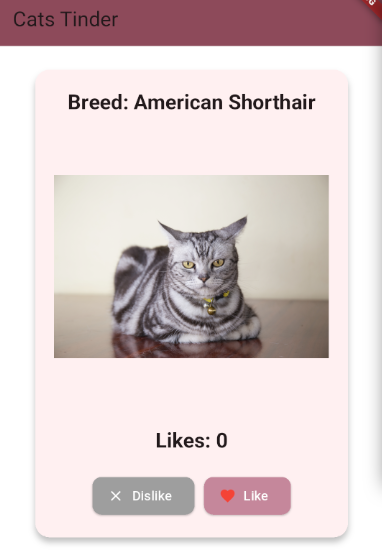
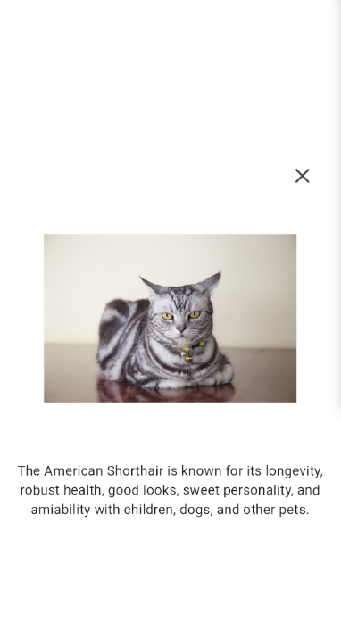

# CatApp

Приложение представляет собой тиндер, только с кошками. Можно свайпать вправо или лайкать понравившихся кошек, можно свайпать влево или дизлайкать котиков, которые не понравились. Для детального описания котика можно нажать на его изображение. Чтобы выйти с появившегося экрана, можно нажать на крестик или повторно нажать на котика.

Был реализован экран со списком всех лайкнутых котиков (справа сверху). Оттуда можно удалять котиков, счетчик при этом уменьшится. Список можно пролистывать, реализован поиск по породе. При возникновении проблем с сетью карточка заменяется на сообщение об ошибке, которое пропадает как только сеть восстанавливается.

Актуальную версию apk можно скачать в репозитории из корня: CatApp.apk

